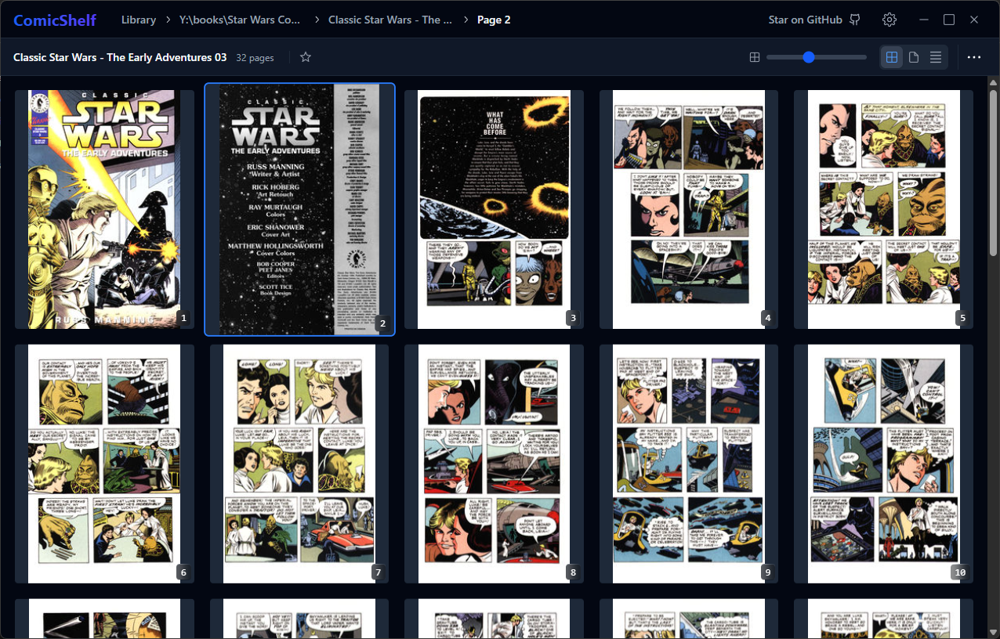
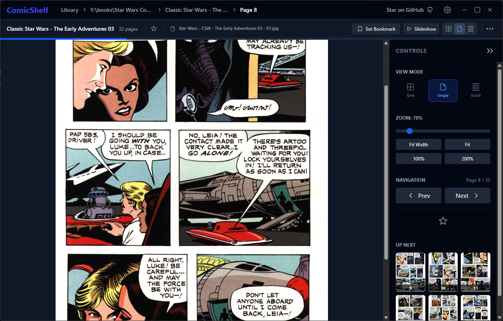
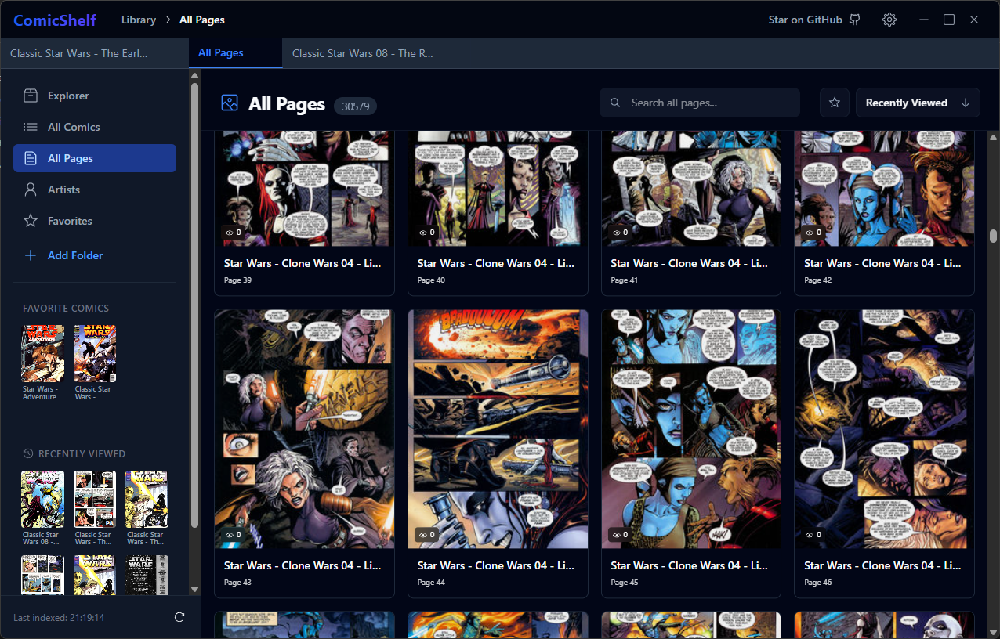
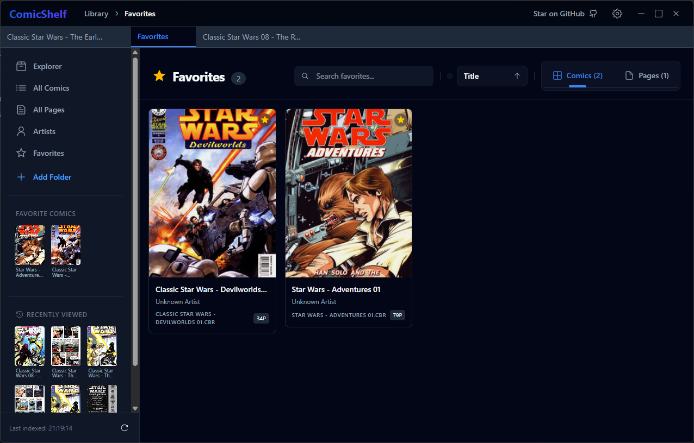

# Comic Shelf

Comic Shelf is a modern, fast, and feature-rich comic reader for Windows, Linux and MacOS, designed to provide a seamless reading experience for your local comic collection. It features various viewing modes, efficient library management, easy setup and a user-friendly interface.

Comic Shelf supports CBZ and CBR files, PDF documents and simple folders of images.

## Quick Look

| Library View | Single Page View |
|:---:|:---:|
|  |  |

| All Pages Overview | Favorites |
|:---:|:---:|
|  |  |

## Features

- **Performance-First**: Built with Rust and Tauri for native performance and low resource usage. With your comic library indexed in a local SQLite database and virtualized page lists, Comic Shelf scales effortlessly for even large collections.
- **Multiple Viewing Modes**:
  - **Overview**: See all pages of a comic at a glance.
  - **Single Page**: Classic reading experience with zoom and fit-width options.
  - **Scroll Mode**: Continuous vertical scrolling across all pages.
- **Smart Library Management**:
  - Automatically indexes your local folders.
  - Recursive scanning with metadata extraction.
  - Thumbnail generation and caching.
  - Support for organizing content by artists, series, or custom folder structures.
- **Reading Enhancements**:
  - **Favorites**: Mark comics or specific pages as favorites.
  - **Read Status**: Tracks your reading progress, bookmarks and view counts.
  - **Tab System**: Open multiple comics or views in tabs.

## Installation

Download the latest release for your platform from GitHub:

[**Download Latest Release**](https://github.com/lukasbach/comic-shelf/releases/latest)

## Getting Started

### Indexing Your Library

To start reading, you need to tell Comic Shelf where your comics are located:

1. Launch the application.
2. Click on **Add Folder** to select a directory on your computer containing your comic files (images or folders of images).
3. The application will automatically start scanning and indexing your comics. You can monitor the progress in the sidebar.

Once indexed, your comics will appear in the **Explorer** view.

## Hotkeys

Comic Shelf comes with a set of default hotkeys to navigate quickly. You can customize these in the **Settings** menu.

| Action | Default Key |
|---|---|
| **Next Page** | `ArrowRight` |
| **Previous Page** | `ArrowLeft` |
| **Scroll Up** | `ArrowUp` |
| **Scroll Down** | `ArrowDown` |
| **Zoom In** | `+` |
| **Zoom Out** | `-` |
| **Toggle Slideshow** | `s` |
| **Toggle View Mode** | `v` |
| **Close Tab** | `w` |
| **Next Tab** | `Ctrl` + `Tab` |
| **Previous Tab** | `Ctrl` + `Shift` + `Tab` |

## Tech Stack

This project leverages modern web and native technologies to deliver a high-quality desktop application:

- **Core**: [Tauri v2](https://tauri.app/) (Rust backend + Web frontend)
- **Frontend Framework**: [React](https://react.dev/)
- **Styling**: [Tailwind CSS v4](https://tailwindcss.com/)
- **Routing**: [TanStack Router](https://tanstack.com/router)
- **State Management & Data**: 
  - [TanStack Virtual](https://tanstack.com/virtual) for efficient grid rendering.
  - [dnd-kit](https://dndkit.com/) for drag-and-drop interactions.
  - SQLite (via `tauri-plugin-sql`) for local data persistence.
